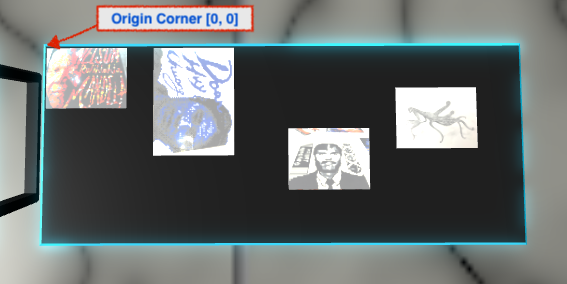
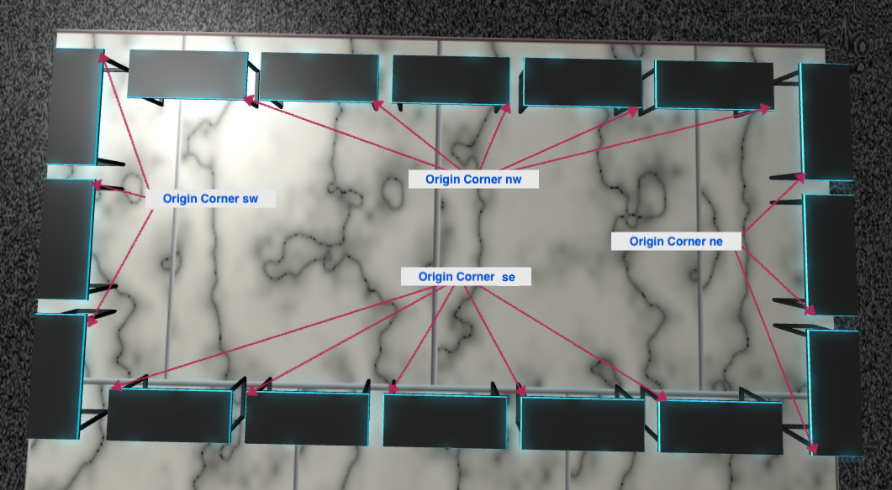

# Content Placers Reference

This document provides a reference for 'content placer algorithms' used to layout content in the 3D world space. These are used within the "layouts" sections of 'content module files'. For more details on content module files see the [Creating and Testing Content Module Files Tutorial](tutorial-content-module-files.md)

Module files are how we specify what 3D objects and other assets are used in the world space and where they are located. For more details on module files see the [Module File Specification](modulefile-specification.md) and the [SquidSpace Module File requirements](squidspace-modulefiles.md).

Squid Hall uses a number of 'placer algorithms' in the "layouts" section of module files to position 3D objects within the world space. (See the 'Full List of Placer Algorithms' below.) Most of these are used for placing the elements of the Arena (the 'Squid Hall' itself) or the 'furniture' within the Arena. However, four placer algorithms are commonly used to place exhibit hall 'content', such as pictures or 3D objects:

* Single - Places a single item at a specified position in the space (used for content 3D objects not placed on furniture)

* ArtPlacer - Places images on art panels (used for pictures)

* TablePlacer - Places images and objects on tables (used for pictures and 3D objects)

* PlinthPlacer - Places objects on plinths (used for 3D objects)

Each of these is described in detail below.

## Full List of Placer Algorithms

Basic placer algorithms (mostly used for placing furniture):

* Single - Places a single item at a specified position in the space

* LinearSeries - Places a series of items in a row in the space, you can specify the direction the row goes and the number of items in the series

* RectangleSeries - Places a series of items in a rectangle

Squid hall-specific placer algorithms for furniture and world items (most require code changes to modify where things are placed):

* LightPlacer - Puts lights in a predetermined position in the hall

* BeamPlacer - Puts the beams in predetermined position in the hall ceiling

* BannerPlacer - Puts the beams in predetermined position in the hall ceiling

* CurtainPlacer - Puts the curtains in predetermined position around the hall

* SquidPlacer - Puts the squid on the back of the hall

* SignFullPlacer - Puts the large signs in predetermined positions around the hall

* SignHalfPlacer - Puts the smaller signs in predetermined positions around the hall

Squid hall-specific content placer algorithms for placing art and object content onto furniture (do not require code changes to use):

* ArtPlacer - Places images on art panels

* TablePlacer - Places images and objects on tables

* PlinthPlacer - Places objects on plinths

## A Note about Texture and Object Resources

This document does not cover the "resources" section of module files, instead referring to 'loaded textures' or 'loaded objects'. However, in order for a texture or an object to be loaded it must be properly specified in the "resources" section and, moreover, the related asset file(s) must be available.

### Texture Resources

Texture resources may be placed by hand into the 'textures' subdirectory and used from there. But, for content images used as texture resources, the more common use case is to fetch the raw images from a URL and process them before placing them in the 'textures/content/' subdirectory using the SquidSpace asset pipeline functionality. For more on this see [How To Manage Content for Squid Hall](how-to-content-management.md). 

Among other things, this means textures need to have the correct configuration and options in the "resources" section of the module file. For more detail on this see the [SquidSpace Module File requirements](squidspace-modulefiles.md).

### Object Resources

At this time we do not support object resources in object pipelines. This means objects must be converted by hand to '.babylon' format and placed into the "objects" subdirectory for use. For more on this see [How To Convert .obj Files to .babylon files](how-to-convertobjtobabylon.md). 

Among other things, this means objects need to have the correct configuration and options in the "resources" section of the module file. For more detail on this see the [SquidSpace Module File requirements](squidspace-modulefiles.md).

## A Note about Layouts, Object Placers, and Object Names

The [Module File Specification](modulefile-specification.md) and the [SquidSpace Module File requirements](squidspace-modulefiles.md) documents detail how layouts work, with the latter document providing considerable information on the object placer declarations. However, neither document specifies how object placer algorithms *work*.

Put simply, an object placer is a function that is called with information from a module file, creates one or more 3D object instances (sometimes cloned from existing objects) and puts them in specific places in the 3D space. This object placer function is registered with SquidSpace with a name, but is not necessarily provided by SquidSpace and may be a custom implementation. For example, the ArtPlacer, TablePlacer and PlinthPlacer placer algorithms are specific to the Squid Hall project and even contain hard-coded expectations about the objects they are placing art frames on. Other placer algorithms, such as 'Single' and 'LinearSeries' are SquidSpace 'builtins'.

Basically, while processing layouts SquidSpace calls the function registered with the placer name in the object placer declaration, passing the options and data values from the declaration along with other context, such as the layout area and the object specified in the object placer declaration. The placer function can perform this placement any way it likes and, moreover, can place as many 3D objects as it likes. 

It is not required, but the placer function can also register the 3D objects it creates and places with SquidSpace using a unique name that only refers to that one 3d object within the space. These names must adhere to the following rules:

* The name must be namespaced by the layout area using dot notation; for example, a 3D object registered with the 'place name' 'foo' in layout area 'bar' has the name 'foo.bar'

* If the placer function creates multiple copies of a 3D object and registers them, it must extend the 'place name' with a dash and a unique number for each instance; for example, three 3D objects with the 'place name' 'foo' in layout area 'bar' will have the names 'bar.foo-0', 'bar.foo-1', and 'bar.foo-3'

This naming scheme allows us to specify particular objects placed by the SquidSpace layout engine in a separate module file, so long as the placer function registers the object. If the placed 3D object will never need to be referred to later it is not necessary. 

## A Note about Position, Rotation, and Size Values

There are some important things you need to know about Position, Rotation, and Size values:

* They are specified in 'world units', which are approximately one meter per unit

* Different placer algorithms may use the named values differently

* Different placer algorithms may expect different value sets for the same named value

* What values work or do not work may be placer algorithm dependent

Where there are differences, the section describing each content placer algorithm below provides more information. More generally there are some commonalities in these values as well. These are discussed next.

### Position

A "position" value is specified as a 'three tuple' of 'x, y, and z' for 3D object placement and as a 'two tuple' of 'x and y' for 2D placement. The 'Single' placer algorithm does 3D placement, but actually ignores the 'y' (vertical) value and places the object directly on the floor. The 'ArtPlacer' and 'TablePlacer' algorithms both do 2D placement, but do them slightly differently:

* The ArtPlacer does vertical placement on the side of a panel; using x and y to mean offset right (x) and offset down (y) from the top left of the selected panel side

* The TablePlacer does horizontal placement on the top of a table; using x and y to mean offset right (x) and offset away (y) from the selected 'origin corner'; see 'A Note about Origin Corners' below

### Rotation

A "rotation" value is specified as a 'three tuple' of 'x, y, and z' and specifies how a 3D object is rotated when it is placed. This generally means the amount of rotation about each axis; where x and z are 'horizontal' axises and y is the vertical axis. In most cases the only rotation you will want to use is the y axis, because that turns the object to face a different direction as if you were to rotate it around it's base; like turning a glass on a table. Changing x or y will cant the object left/right or forward/back and are rarely required.

NOTE: The current implementation of rotation for some placer algorithms actually ignore all rotation axises except y. 

### Size

For all the placer algorithms using it the "size" value is a 'two tuple' of 'x and y' and specifies a 2D size similar to Position with 2D placement. In this case x refers to the width and y refers to the height or depth (depending on whether the placement is vertical or horizontal). This is even the case with the TablePlacer when placing a 3D object: in this case you are specifying the area size you expect the 2D object to use on the table, meaning you may need to scale the object up or down to fit into that space properly.

## A Note about Origin Corners

The ArtPlacer, TablePlacer and PlinthPlacer placer algorithms are very similar, but each is optimized for placing image frames or objects on a specific 3D object type: ArtPlacer knows about art panels and image frames and places frames right to left and top to bottom. TablePlacer knows about tables and places frames or 3D objects right to left and back to front. PlinthPlacer knows about plinths and can place one 3D object on a plinth.

For more information on the ArtPlacer, TablePlacer and PlinthPlacer placer algorithms see the [Content Placers Reference](content-placers-reference.md).

For ArtPlacer and TablePlacer algorithms the frame size is specified as Width x Height (W/H). The size should retain the proportions of the original image for best results. In general a width of 0.5 or less and a proportional height work best.

For ArtPlacer and TablePlacer algorithms the frame position is specified as X x Y (X/Y) using a 2D coordinate system to place the fames on the target 3D object. With the ArtPlacer the coordinates are vertical and the 0/0 point is the upper left corner. With the TablePlacer the coordinates are horizontal and the 0/0 point is a specified corner of the table. 

Note that sizes and positions are specified in 3D space units; which are approximately 1 meter per unit. The art panels are 1 unit high and 0.6 units wide. The tables are 0.9 units long and 0.375 units deep.

With the ArtPlacer you specify placing the frames on the 'front' or the 'back', where the front is generally towards the north end of the space on non-rotated panels and towards the west end of the space on rotated panels.

With the TablePlacer you specify a corner of the table to use as the 'origin'. (The 0/0 position.) The 'origin corner' value must be one of 'nw', 'ne', 'sw', or 'se' to specify which corner of the table is the 'back-left' for purposes of placing image frames on the table.

Note that the user spawns in the NW corner of Squid Hall facing SE. So 'north' is the end of the hall with the art show and the history area and 'south' is the end of the hall with the squid. 

This means for each table you must determine where the 'back' and 'front' of the table is in relation to how the table is placed/rotated in the space and how it would be approached by users; then determine the best origin corner from that. Generally if a table is not rotated and you approach it from the north, the origin corner should be 'se'; whereas if you approach it from the south the origin corner should be 'ne'. A rotated table works the same, but for east approaches you want 'sw' and for west approaches you want 'ne'.

With the PlinthPlacer algorithm you can only specify the object rotation and scaling, since there is only one 3D object per plinth.

NOTE: When placing objects the 3D object files need to be converted to .bablyon format by hand. For more on this see [How To Convert .obj Files to .babylon files](how-to-convertobjtobabylon.md)

## Single

The 'Single' placer algorithm is used to place a single instance of a 3D object in a particular position within the hall. Although it is also used for furniture placement, it is also useful for placing content 3D objects which are not placed on furniture. 

Example:

	"object": "name-of-a-loaded-object",
	"data": [
		{
			"place-name": "name-of-placement",
			"options": {
				"placer": "Single",
				"moreInfoData": {
					"title": "A name of some person or thing",
					"link-text": "Some person or thing's page",
					"link": "https://example.com/somepersonorthing",
					"text": "Some text describing a person or thing."
				}
			},
			"data": {
				"position": [16.3, 0.01, 0.5],
				"rotation": [0, 1.57, 0]
			}
		},
		
		. . . More placements related to the object. (Optional.)
	]

The "object" value specifies the name of a loaded object to place. (This is different from the other content placers described below.) The "data" value contains an array of 'placements' for that object; each of which consists of a "place-name", "options", and "data". These are described below.

Place Name: A unique name for the placement. 

Options:

* "placer" – [string, required] Specifies the placer algorithm, must be "Single"

* "moreInfoData" - [dictionary, optional] Specifies data to be shown in a popup dialogue if the user clicks on the object to learn more
   - "title" [string, required] The title of the popup
   - "link-text" [string, required if 'link' is provided] The text for the link
   - "link" [string, required, required if 'link-text' is provided] A link to a web page with more information
   - "text" [string, required] Some text describing the item

Data:

* "position" – [array of numbers expressed as x, y, z; required] Specifies the position within the world space; see 'A Note about Position, Rotation, and Size Values' above
   - NOTE: 'y' value is ignored and the item is placed directly on the floor
   
* "rotation" – [array of numbers expressed as x, y, z; optional] Specifies the object's rotation; see 'A Note about Position, Rotation, and Size Values' above
   - NOTE: 'x' and 'z' values are ignored, you can only rotate around the vertical axis

## ArtPlacer

The 'ArtPlacer' placer algorithm is used to place a multiple instances of 'framed' textures (images) on either the front or back side of an art panel. It is optimized for art panels and will produce unexpected results if used with any other 3D object type. 

Example:

	"object": "name-of-a-loaded-art-panel-object",
	"data": [
		{
			"place-name": "name-of-placement",
			"options": {
				"placer": "ArtPlacer",
				"moreInfoData": {
					"title": "A name of some person or thing",
					"link-text": "Some person or thing's page",
					"link": "https://example.com/somepersonorthing",
					"text": "Some text describing a person or thing."
				}
			},
			"data": {
				"textures": [
					{
						"texture": "texture-name-1",
						"size": [0.6, 0.45],
						"position": [0, 0]
					},
					
					. . . More textures. (Optional.)
					
				],
				"place-on": "front"
			}
		},
		
		. . . More placements related to the art panel. (Optional.)
	]

The "object" value specifies the name of a loaded *and placed* art panel object to place the art *on*, not the object to place. (This is different from the 'Single' placer described above.) The "data" value contains an array of 'placements' for that object; each of which consists of a "place-name", "options", and "data". These are described below.

Place Name: A unique name for the placement. 

Options:

* "placer" – [string, required] Specifies the placer algorithm, must be "ArtPlacer"

* "moreInfoData" - [dictionary, optional] Specifies data to be shown in a popup dialogue if the user clicks on the object to learn more
   - "title" [string, required] The title of the popup
   - "link-text" [string, required if 'link' is provided] The text for the link
   - "link" [string, required, required if 'link-text' is provided] A link to a web page with more information
   - "text" [string, required] Some text describing the item

Data:

* "textures" - [array of texture references, required] Specifies what textures/images to place on the art panel, each of which consists of:
   - "texture" - [string, required] specifies the name of a loaded texture to use
   - size": [array of numbers expressed as 'width', 'height'; required] specifies the width and height of the image in world units; see 'A Note about Position, Rotation, and Size Values' above
   - position": [array of numbers expressed as 'x', 'y'; required] specifies the vertical and horizontal position of the image in world units on the art panel; see 'A Note about Position, Rotation, and Size Values' and 'A Note about Origin Corners' above

* "place-on" [string, must be one of 'front' or 'back'; required] Specifies whether you are placing the images on the front or the back of the art panel

## TablePlacer

The 'TablePlacer' placer algorithm is used to place a multiple instances of 'framed' textures (images) or 3D objects on a table. It is optimized for tables and will produce unexpected results if used with any other 3D object type. 

Example:

	"object": "name-of-a-loaded-table-object",
	"data": [
		{
			"place-name": "name-of-placement",
			"options": {
				"placer": "TablePlacer",
				"moreInfoData": {
					"title": "A name of some person or thing",
					"link-text": "Some person or thing's page",
					"link": "https://example.com/somepersonorthing",
					"text": "Some text describing a person or thing."
				}
			},
			"data": {
				"textures": [
					{
						"texture": "texture-name-2",
						"size": [0.3, 0.4],
						"position": [0.4, 0]
					},
					{
						"texture": "texture-name-3",
						"tilted": true,
						"size": [0.3, 0.225],
						"position": [0.9, 0.3]
					},
					
					. . . More textures. (Optional.)
				],
				"objects": [
					{								
						"object": "name-of-a-loaded-object",
						"rotation": [0, 0, 0],
						"position": [1.4, 0.5],
						"size": [0.2, 0.2],
						"scale": 0.1	
					}
					
					. . . More objects. (Optional.)
				],
				"origin-corner": "nw"
			}
		},
		
		. . . More placements related to the table. (Optional.)
	]

The "object" value specifies the name of a loaded *and placed* table object to place the images or 3D objects *on*, not the object to place. (This is different from the 'Single' placer described above.) The "data" value contains an array of 'placements' for that object; each of which consists of a "place-name", "options", and "data". These are described below.

Place Name: A unique name for the placement. 

Options:

* "placer" – [string, required] Specifies the placer algorithm, must be "TablePlacer"

* "moreInfoData" - [dictionary, optional] Specifies data to be shown in a popup dialogue if the user clicks on the object to learn more
   - "title" [string, required] The title of the popup
   - "link-text" [string, required if 'link' is provided] The text for the link
   - "link" [string, required, required if 'link-text' is provided] A link to a web page with more information
   - "text" [string, required] Some text describing the item

Data:

* "textures" - [array of texture references, optional] Specifies what textures/images to place on the table, each of which consists of:
   - "texture" - [string, required] specifies the name of a loaded texture to use
   - tilted" [boolean, optional; default value is false] Specifies whether the art frame object containing the image is flat on the table (false) or tilted up from the table (true)
   - size": [array of numbers expressed as 'width', 'height'; required] specifies the width and height of the image in world units; see 'A Note about Position, Rotation, and Size Values' above
   - position": [array of numbers expressed as 'x', 'y'; required] specifies the left-to-right and top-to-bottom position of the image in world units on the table; see 'A Note about Position, Rotation, and Size Values' and 'A Note about Origin Corners' above

* "objects" - [array of object references, optional] Specifies what 3D objects to place on the table, each of which consists of:
   - "object" - [string, required] specifies the name of a loaded 3D object to use
   - size": [array of numbers expressed as 'width', 'depth'; required] specifies the width and depth of the object in world units; see 'A Note about Position, Rotation, and Size Values' above
   - position": [array of numbers expressed as 'x', 'y'; required] specifies the left-to-right and top-to-bottom position of the object in world units on the table; see 'A Note about Position, Rotation, and Size Values' and 'A Note about Origin Corners' above
   - "rotation" - [array of numbers expressed as x, y, z; optional] Specifies the object's rotation; see 'A Note about Position, Rotation, and Size Values' above
   - "scale" - [number, optional] Specifies a scaling factor for the 3D object; a value less than 1 scales the object smaller, a value of 1 does not change the object's size, a value greater than 1 scales the object larger

* "origin-corner" [string, must be one of 'nw', 'ne', 'sw', or 'se'; required] Specifies the corner to start laying out the items from; see 'A Note about Origin Corners' above

## PlinthPlacer 

The 'PlinthPlacer' placer algorithm is used to place a single instance of a 3D object on a plinth. It is optimized for plinths and will produce unexpected results if used with any other 3D object type. 

Example:

	"object": "name-of-a-loaded-plinth-object",
	"data": [
		{
			"place-name": "name-of-placement",
			"options": {
				"placer": "PlinthPlacer",
				"moreInfoData": {
					"title": "A name of some person or thing",
					"link-text": "Some person or thing's page",
					"link": "https://example.com/somepersonorthing",
					"text": "Some text describing a person or thing."
				}
			},
			"data": {
				"object": "name-of-a-loaded-object",
				"rotation": [0, 1.57, 0],
				"scale": 0.1
			}
		}
		
		. . . PlinthPlacer placements must only use *one* placement, for a single ojbect. 
	]

The "object" value specifies the name of a loaded *and placed* plinth object to place the images or 3D objects *on*, not the object to place. (This is different from the 'Single' placer described above.) The "data" value contains an array of 'placements' for that object; each of which consists of a "place-name", "options", and "data". These are described below.

Place Name: A unique name for the placement. 

Options:

* "placer" – [string, required] Specifies the placer algorithm, must be "PlinthPlacer"

* "moreInfoData" - [dictionary, optional] Specifies data to be shown in a popup dialogue if the user clicks on the object to learn more
   - "title" [string, required] The title of the popup
   - "link-text" [string, required if 'link' is provided] The text for the link
   - "link" [string, required, required if 'link-text' is provided] A link to a web page with more information
   - "text" [string, required] Some text describing the item

Data:

* "object" - [string, required] specifies the name of a loaded 3D object to use

* "rotation" - [array of numbers expressed as x, y, z; optional] Specifies the object's rotation; see 'A Note about Position, Rotation, and Size Values' above

* "scale" - [number, optional] Specifies a scaling factor for the 3D object; a value less than 1 scales the object smaller, a value of 1 does not change the object's size, a value greater than 1 scales the object larger

