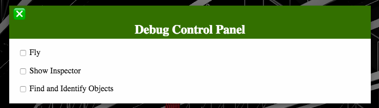
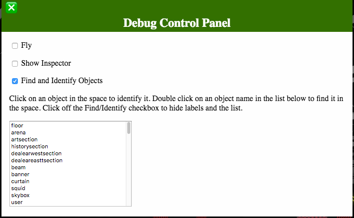

# Tutorial: Creating and Testing Content Module Files

Content module files are the way we specify what website content is hosted in the Virtual Squid Hall and where that content is located in the 3D space. Content module files consist of JSON data formatted according to the [Module File Specification](modulefile-specification.md) to the [SquidSpace Module File requirements](squidspace-modulefiles.md). See also, 'Annotated Example Content Module File' and 'Full Example Content Module File' below for detailed examples.

When you are ready to continue, read on to 'Tutorial Steps' below.

### What this tutorial covers

This tutorial will take you step by step through the process of creating and testing a content module file. After the tutorial steps there are some more detailed descriptions of certain content file values, followed by a template module file, an annotated module file, and a full example of a module file.

When you finish this tutorial you should understand the basics of content module files and how to use the SquidSpace tools to manage the asset pipeline, generate Javascript modules and test/debug a content module file.

### What this tutorial does not cover

You may be required to use Git for version control, which requires the following steps:

1. Cloning the Git repo

2. Creating a branch and modifying it

3. Committing your changes and pushing the branch to the Git repo

4. Making a 'Pull Request' for your branch

These things are important to the process and even if you are not required to do them, someone will be. 

However, using Git – or other methods of putting the content files you create onto the production server – falls outside the purview of this tutorial.

## Tutorial Steps

The process of creating a content module file requires you to determine which images you want to include from the website. You can create one content module file per web page or you can combine content from multiple web pages into a single content module file. For this tutorial we are going to create a content module for a single web page in nine steps.

Start with Step 1 below.

### Step 1. Create a new content module file

Create a new file using a plain text editor. Do not use a WYSIWYG word processor unless you know how to change and save the file as plain text. 

Copy and paste the JSON text in 'Content Module Template' below. Then save the file using a name appropriate to the web page you are working on with a 'triple' extension of 'content.module.json'. For this tutorial we are going to save the file as 'ai-weiwei.content.module.json'.

Change the 'MODULE-NAME' value in the template to a unique name appropriate for the module that will be generated. For this tutorial we are going to use 'aiweiwei'.

Continue with Step 2 below.

### Step 2. Open a web page with a gallery

Navigate your web browser to the content page you want to use. In this tutorial we are going to use this page on the test site: https://squid.fanac.com/art-show/ai-weiwei/

When the page comes up you will see the image gallery and some information about the artist. We are going to use that information to fill out the content module file.

Continue with Step 3 below.

### Step 3. Determine which images you will use

You may already have a list of images to use, supplied by the artist or someone else. If not you should look at the gallery and decide which images are appropriate. In any case you also need to consider how many images you can fit onto an art panel or a table. Generally you can place no more than four or five images on an art panel or a table without sizing them too small for easy visibility. Also, overall, the fewer total images the better because we have a goal of minimal system requirements to view the 3D space and every image uses memory and CPU resources at runtime.

For this tutorial we are going to use the first two images in the gallery, plus the fifth image; for a total of three.

Continue with Step 4 below.

### Step 4. Create a texture resource declaration for each image

In the template file there is a "resources" section that contains a "textures" section. In the "textures" section there is a texture resource declaration template. We are going to use three images for our resources, so copy that template and paste it two more times for a total of three. Make sure to remove the comma after the last texture resource declaration so the JSON parser doesn't have a fit.

For each image change the 'RESOURCE-NAME' and 'FILE-NAME' values to something unique and appropriate. For this tutorial are going to use 'ai-weiwei-1', 'ai-weiwei-2', and 'ai-weiwei-3'. 

Change the 'IMAGE-URL' to the URL of each image you are going to use. How you get the URL is dependent on the browser you are using; for Firefox I bring up the full-size image in the gallery by clicking on the image and then I right-click on the picture and choose 'Copy Image Location' from the popup menu.

While you are at it you will want to make note of the image dimensions, because you will be using them later in step 5. There are many different ways to get this value, but generally if you 'save as' the image you can open it in a image editing program and it should provide a way to get 'image information' that includes the dimensions. 

See 'Annotated Example Content Module' below for more detail on what each of these JSON elements does and what the expected values are.

When you are done your texture section should look like this:

	"textures": [
		{
			"resource-name": "ai-weiwei-1",
			"config": {
				"cache-options": {
					"url-source": "https://squid.fanac.com/wp-content/uploads/2020/05/IP_0815_-053-scaled.jpg",
					"filter-profile": "ArtJpg"
				},
				"pack-options": {
					"action": "link"
				},
				"file-name": "ai-weiwei-1.png"
			}
		},
		{
			"resource-name": "ai-weiwei-2",
			"config": {
				"cache-options": {
					"url-source": "https://squid.fanac.com/wp-content/uploads/2020/05/IP_0815_-059-scaled.jpg",
					"filter-profile": "ArtJpg"
				},
				"pack-options": {
					"action": "link"
				},
				"file-name": "ai-weiwei-2.png"
			}
		},
		{
			"resource-name": "ai-weiwei-3",
			"config": {
				"cache-options": {
					"url-source": "https://squid.fanac.com/wp-content/uploads/2020/05/IP_0815_-062-scaled.jpg",
					"filter-profile": "ArtJpg"
				},
				"pack-options": {
					"action": "link"
				},
				"file-name": "ai-weiwei-3.png"
			}
		}
	]

If you are doing an art panel layout continue with Step 5.a below. If you are doing a table layout continue with Step 5.b below. (You can do both if you want.)

### Step 5.a. Create an Art Panel Layout

In the template file there is a "layouts" section that contains a 'layout area declaration'. In the layout area there is a 'data' section containing two 'object placement declaration' templates; one for an art panel layout and one for a table layout. We are going to use art panel layout, so you can delete the other one unless you are going to do that step too. Make sure to remove the comma after the last object placement so the JSON parser doesn't have a fit.

#### Modify the Layout Area Name

Each layout area specifies a named area of the 3D space and a 'data' section. The data section contains one to many 'object placement declarations' for objects placed within the named layout area. See 'Layouts, Object Placers, and Object Names' below for more detail. 

Change the 'LAYOUT-AREA-NAME' value to the layout area containing the art panel you will be using. All the layout areas you will be using are pre-defined in the 'furniture.module.json' file. For this tutorial we will be using 'artshow'.

#### Modify the Object Placement Declaration

Each object placement declaration specifies an object and contains a 'data' section. The data section contains one to many 'object placer declarations' for specific placements of copies of the object or for objects placed 'on' the object. In this case we are placing 'framed art images' on an art panel.

Change the 'ART-PANEL-NAME' value to the fully-qualified name of the art panel you will be placing the images on. All the art panels you will be using are pre-defined in the 'furniture.module.json' file. However, the 'fully qualified name' of an already-placed object, such as our art panel, is dependent on the object placer used in the layout. See 'Layouts, Object Placers, and Object Names' below for more detail. 

For this tutorial we will use 'artshow.artpnl-1-ew-1-0' for the 'ART-PANEL-NAME'. In the 'furniture.module.json' file it is specified in the 'artshow' layout area as 'artpnl-1-ew-1' using an object placer that creates a row of objects and adds a number and a dash to the object name for each one. See also 'Using the squidhalltest.html Debugging Features' below for a way you can easily find out the name of any object in the 3D space or find any object in the 3D space by name. 

#### Modify the Object Placer Declaration

Each object placer declaration specifies a 'place name' to use for that placement and contains 'options' and 'data' sections specifying how the placement is done. The place name value may be used for the name of a placed object or, if the placement results in multiple copies of an object, it is the 'root' of each placed object's name. See 'Layouts, Object Placers, and Object Names' below for more detail. 

Change the 'PLACE-NAME' value to a unique name within the layout area. For this tutorial we will use 'ai-weiwei'.

The 'options' section specifies the placer algorithm to use. In this case we are using one named 'ArtPlacer', which creates frames for specified images and locates them on the object specified in the object placement declaration above. 

The 'ArtPlacer' algorithm allows an optional 'moreInfoData' subsection of the 'options' section for information about the placed images. For the 'moreInfoData' values you want to pull the relevant information from the web page. Change 'INFO-TITLE' to a title for a popup dialogue, 'INFO-LINK-TEXT' to the text of an HTML link, 'INFO-URL' to the URL the text links to, and 'INFO-DESCRIPTION' to a more detailed description. For this tutorial we are using the following: 

* "title": "Ai Weiwei",

* "link-text": "Ai Weiwei's Page",

* "link": "https://squid.fanac.com/art-show/ai-weiwei/",

* "text": "Ai Weiwei is a Chinese contemporary artist, active in sculpture, installation, architecture, curating, photography, film, and social, political and cultural. These photos are from an exhibit held of his work on Alcatraz island in the former prison buildings in 2015."

The 'data' section lets you specify which texture resources to use and whether they are placed on the front or the back of the art panel.

Change the 'FRONT-OR-BACK' value to 'front' if you want it on the front of the art panel or 'back' if you want it on the back. For this tutorial we will use 'front'.

The 'textures' subsection of the 'data' section contains one to many 'texture placement specifications'. Since we are placing three images, copy and paste the template texture placement specification two times for a total of three. Make sure to remove the comma after the last texture placement specification so the JSON parser doesn't have a fit.

For each image change the 'RESOURCE-NAME' to one of the 'RESOURCE-NAME' values specified in step 4. The 'WIDTH' and 'HEIGHT' values specify the size and shape of the frame used for the image. What size you use is up to you, except for two considerations:

* We want the size values to reflect the proportions of the original image, which we took note of in Step 4

* The sizes are specified in 3D space units; which are approximately 1 meter per unit (the art panels are 1 unit high and 0.6 units wide)

The same applies to the 'POS-X' and 'POS-Y' position values. Moreover, the position is specified as left to right ('POS-X') and top to bottom ('POS-Y') on the art panel starting from the upper left corner of the chosen side of the panel. 

See 'ArtPlacer and TablePlacer Algorithms' below for more detail on size and position units and how X/Y positioning works.

For this tutorial we are going to use some appropriate values, keeping the size of each image frame less than half as wide as the panel and staggering them a bit. 

See 'Annotated Example Content Module' below for more detail on what each of these JSON elements does and what the expected values are.

When you are done your layouts section should look like this:

	"layouts": [
		{
			"layout-name": "artshow",
			"data": [
				{
					"object": "artshow.artpnl-1-ew-1-0",
					"data": [
						{
							"place-name": "ai-weiwei",
							"options": {
								"placer": "ArtPlacer",
								"moreInfoData": {
									"title": "Ai Weiwei",
									"link-text": "Ai Weiwei's Page",
									"link": "https://squid.fanac.com/art-show/ai-weiwei/",
									"text": "Ai Weiwei is a Chinese contemporary artist, …"
								}
							},
							"data": {
								"textures": [
									{
										"texture": "Ai-Weiwei-1",
										"doc": "Size is WxH.",
										"size": [0.6, 0.45],
										"position": [0, 0]
									},
									{
										"texture": "Ai-Weiwei-2",
										"size": [0.6, 0.8],
										"position": [0.5, 0.6]
									},
									{
										"texture": "Ai-Weiwei-3",
										"size": [0.6, 0.45],
										"position": [0.2, 1.5]
									}
								],
								"place-on": "front"
							}
						}
					]
				}
			]
		}

Continue with Step 6 below.

### Step 5.b. Create a Table Layout

In the template file there is a "layouts" section that contains a 'layout area declaration'. In the layout area there is a 'data' section containing two 'object placement declaration' templates; one for an art panel layout and one for a table layout. We are going to use table layout, so you can delete the other one unless you are going to do that step too. Make sure to remove the comma after the last object placement so the JSON parser doesn't have a fit.

#### Modify the Layout Area Name

Each layout area specifies a named area of the 3D space and a 'data' section. The data section contains one to many 'object placement declarations' for objects placed within the named layout area. See 'Layouts, Object Placers, and Object Names' below for more detail. 

Change the 'LAYOUT-AREA-NAME' value to the layout area containing the table you will be using. All the layout areas you will be using are pre-defined in the 'furniture.module.json' file. For this tutorial we will be using 'artshow'.

#### Modify the Object Placement Declaration

Each object placement declaration specifies an object and contains a 'data' section. The data section contains one to many 'object placer declarations' for specific placements of copies of the object or for objects placed 'on' the object. In this case we are placing 'framed art images' on a table.

Change the 'TABLE-NAME' value to the fully-qualified name of the table you will be placing the images on. All the tables you will be using are pre-defined in the 'furniture.module.json' file. However, the 'fully qualified name' of an already-placed object, such as our table, is dependent on the object placer used in the layout. See 'Layouts, Object Placers, and Object Names' below for more detail. 

For this tutorial we will use 'artshow.ArtShowDesk-1-0' for the 'TABLE-NAME'. In the 'furniture.module.json' file it is specified in the 'artshow' layout area as 'ArtShowDesk-1' using an object placer that creates a row of objects and adds a number and a dash to the object name for each one. See also 'Using the squidhalltest.html Debugging Features' below for a way you can easily find out the name of any object in the 3D space or find any object in the 3D space by name. 

#### Modify the Object Placer Declaration

Each object placer declaration specifies a 'place name' to use for that placement and contains 'options' and 'data' sections specifying how the placement is done. The place name value may be used for the name of a placed object or, if the placement results in multiple copies of an object, it is the 'root' of each placed object's name. See 'Layouts, Object Placers, and Object Names' below for more detail. 

Change the 'PLACE-NAME' value to a unique name within the layout area. For this tutorial we will use 'ai-weiwei-tbl'.

The 'options' section specifies the placer algorithm to use. In this case we are using one named 'TablePlacer', which creates frames for specified images and locates them on the object specified in the object placement declaration above. 

The 'TablePlacer' algorithm allows an optional 'moreInfoData' subsection of the 'options' section for information about the placed images. For the 'moreInfoData' values you want to pull the relevant information from the web page. Change 'INFO-TITLE' to a title for a popup dialogue, 'INFO-LINK-TEXT' to the text of an HTML link, 'INFO-URL' to the URL the text links to, and 'INFO-DESCRIPTION' to a more detailed description. For this tutorial we are using the following: 

* "title": "Ai Weiwei",

* "link-text": "Ai Weiwei's Page",

* "link": "https://squid.fanac.com/art-show/ai-weiwei/",

* "text": "Ai Weiwei is a Chinese contemporary artist, active in sculpture, installation, architecture, curating, photography, film, and social, political and cultural. These photos are from an exhibit held of his work on Alcatraz island in the former prison buildings in 2015."

The 'data' section lets you specify which texture resources to use and what the 'origin corner' for the table is. 

Change the 'ORIGIN-CORNER' value to one of 'nw', 'ne', 'sw', or 'se' to specify which corner of the table is the 'back-left' for purposes of placing image frames on the table. For this tutorial we will use 'nw'. See 'Layouts, Object Placers, and Object Names' below for more detail on the origin corner.

The 'textures' subsection of the 'data' section contains one to many 'texture placement specifications'. Since we are placing three images, copy and paste the template texture placement specification two times for a total of three. Make sure to remove the comma after the last texture placement specification so the JSON parser doesn't have a fit.

For each image change the 'RESOURCE-NAME' to one of the 'RESOURCE-NAME' values specified in step 4. The 'WIDTH' and 'HEIGHT' values specify the size and shape of the frame used for the image. What size you use is up to you, except for two considerations:

* We want the size values to reflect the proportions of the original image, which we took note of in Step 4

* The sizes are specified in 3D space units; which are approximately 1 meter per unit (the tables are 0.9 units long and 0.375 units deep)

The same applies to the 'POS-X' and 'POS-Y' position values. Moreover, the position is specified as left to right ('POS-X') and top to bottom ('POS-Y') on the art panel starting from the upper left corner of the chosen side of the panel. 

See 'ArtPlacer and TablePlacer Algorithms' below for more detail on size and position units and how X/Y positioning works.

For this tutorial we are going to use some appropriate values, keeping the size of each image frame less than half as wide as the panel and staggering them a bit. 

See 'Annotated Example Content Module' below for more detail on what each of these JSON elements does and what the expected values are.

When you are done your layouts section should look like this:

	"layouts": [
		{
			"layout-name": "artshow",
			"data": [
				{
					"object": "artshow.artpnl-1-ew-1-0",
					"data": [
						{
							"object": "artshow.ArtShowDesk-1-0",
							"data": [
								{
									"place-name": "ai-weiwei-tbl",
									"options": {
										"placer": "TablePlacer",
										"moreInfoData": {
										"title": "Ai Weiwei",
										"link-text": "Ai Weiwei's Page",
										"link": "https://squid.fanac.com/art-show/ai-weiwei/",
										"text": "Ai Weiwei is a Chinese contemporary artist, …"
										}
									},
									"data": {
										"textures": [
											{
												"texture": "RESOURCE-NAME",
												"size": [WIDTH, HEIGHT],
												"position": [POS-X, POS-Y]
											},
										
										],
										"origin-corner": "nw"
									}
								}
							]
						}
					]
				}
			]
		}

Continue with Step 6 below.

### Step 6. Validate the JSON

It's important that the JSON you create is properly formed. If it is invalid in some way the SquidSpace tools will fail to load it with an ugly-looking JSON parsing error, which might not be overly helpful in pinpointing exactly where you went wrong. 

Your text editor may validate the JSON as you enter it. If not and the text editor doesn't support some other form of JSON validation you will want to use an external validator. There are several on the Internet; you can search for one and use it by copying the JSON text in your text editor and pasting it into the validator page. 

Note that these kinds of validators can only verify the JSON is properly formed. If you do not include information the SquidSpace tools are expecting to see you may get an entirely different kind of error. For this reason it is important to make sure you start from the template below and follow the instructions exactly.

When you are sure your JSON is correct, continue with Step 7 below.

### Step 7. Run the Asset Pipeline

NOTE: This step may have system requirements. See 'Using the SquidSpace Tools' below.

For this tutorial we will run the asset pipeline locally and verify the pipeline can fetch and convert the images as specified in the content module file. 

To run the asset pipeline enter the following line in a terminal session from the working directory:

	& python3 tools/sqs/sqs.py pipeline ai-weiwei.content.module.json

If the command fails because the content module file is incorrect in some way you will see one or more error messages. You may need to return to one of the previous steps of the tutorial and work forward again from there.

Otherwise you will need to verify everything worked. To do this, look in the 'textures/content' directory. There should be three files named 'ai-weiwei-1.png', 'ai-weiwei-2.png', and 'ai-weiwei-3.png'.

When you are sure the asset pipeline has run correctly, continue with Step 8 below.

### Step 8. Generate the Javascript Module

NOTE: This step may have system requirements. See 'Using the SquidSpace Tools' below.

For this tutorial we will run the code generator locally and verify the generator can create a valid module file. 

To run the code generator enter the following line in a terminal session from the working directory:

	& python3 tools/sqs/sqs.py generate ai-weiwei.content.module.json

If the command fails because the content module file is incorrect in some way you will see one or more error messages. You may need to return to one of the previous steps of the tutorial and work forward again from there.

Otherwise you will need to verify everything worked. To do this, look in the 'libs/modules' directory. There should be a Javascript module named 'aiweiwei.js'. At a minimum there should also be 'world.js' and 'furniture.js' files as well. If they do not exist you will need to generate them from the 'world.module.json' and 'furniture.content.json' module files.

When you are sure all required module are generated, continue with Step 9 below.

### Step 9. Test and Debug in the 3D Space

NOTE: This step may have system requirements. See 'Using the SquidSpace Tools' below.

For this tutorial we will run a local web server and visually verify the results using the squidhalltest.html page. 

To run the web server enter the following line in a terminal session from the working directory:

	& python3 tools/sqs/sqs.py serve

Once the web server is running, start a web browser and navigate to http://localhost:8000/squidhalltest.html

The test page should load and present you with a view of the 3D space. It might take a while before all the assets are loaded and you can navigate around. If it fails to load take a look at the web browser console and see if there are any clues to why in the debug and error messages there. 

You should be able to 'walk' up to the art panel or table you used in the tutorial and visually verify the expected image are sized and positioned as you expected them. If the images are not there at all take a look at the web browser console and see if there are any clues to why in the debug and error messages there. 

If you found a problem that requires correction, go back to one of the previous steps. If everything looks good, you have completed the tutorial and can read below for more detail on how things work.

## Layouts, Object Placers, and Object Names

The [Module File Specification](modulefile-specification.md) and the [SquidSpace Module File requirements](squidspace-modulefiles.md) documents detail how layouts work, with the latter document providing considerable information on the object placer declarations. However, neither document specifies how object placer algorithms *work*.

Put simply, an object placer is a function that is called with information from a module file, creates one or more 3D object instances (sometimes cloned from existing objects) and puts them in specific places in the 3D space. This object placer function is registered with SquidSpace with a name, but is not necessarily provided by SquidSpace and may be a custom implementation. For example, ArtPlacer and TablePlacer object placer algorithms are specific to the Squid Hall project and even contain hard-coded expectations about the objects they are placing art frames on. Other placer algorithms, such as 'LinearSeries' are SquidSpace 'builtins'.

Basically, while processing layouts SquidSpace calls the function registered with the name in the object placer declaration, passing the options and data values from the declaration along with other context, such as the layout area and the object specified in the object placer declaration. The placer function can perform this placement any way it likes and, moreover, can place as many 3D objects as it likes. 

It is not required, but the placer function can also register the 3D objects it creates and places with SquidSpace using a unique name that only refers to that one 3d object within the space. These names must adhere to the following rules:

* The name must be namespaced by the layout area using dot notation; for example, a 3D object registered with the 'place name' 'foo' in layout area 'bar' has the name 'foo.bar'

* If the placer function creates multiple copies of a 3D object and registers them, it must extend the 'place name' with a dash and a unique number for each instance; for example, three 3D objects with the 'place name' 'foo' in layout area 'bar' will have the names 'foo.bar-0', 'foo.bar-1', and 'foo.bar-3'

This naming scheme allows us to specify particular objects placed by the SquidSpace layout engine in a separate module file, so long as the placer function registers the object. If the placed 3D object will never need to be referred to later it is not necessary. 

## ArtPlacer and TablePlacer Algorithms

The ArtPlacer and TablePlacer placer algorithms are very similar, but each is optimized for placing image frames on a specific 3D object type: ArtPlacer knows about art panels and places frames right to left and top to bottom, while TablePlacer knows about tables and places frames right to left and back to front. 

For both algorithms the frame size is specified as Width x Height (W/H). The size should retain the proportions of the original image for best results. In general a width of 0.5 or less and a proportional height work best.

For both algorithms the frame position is specified as X x Y (X/Y) using a 2D coordinate system to place the fames on the target 3D object. With the ArtPlacer the coordinates are vertical and the 0/0 point is the upper left corner. With the TablePlacer the coordinates are horizontal and the 0/0 point is a specified corner of the table. 

Note that sizes and positions are specified in 3D space units; which are approximately 1 meter per unit. The art panels are 1 unit high and 0.6 units wide. The tables are 0.9 units long and 0.375 units deep.

With the ArtPlacer you specify placing the frames on the 'front' or the 'back', where the front is generally towards the north end of the space on non-rotated panels and towards the west end of the space on rotated panels.

With the TablePlacer you specify a corner of the table to use as the 'origin'. (The 0/0 position.) The 'origin corner' value must be one of 'nw', 'ne', 'sw', or 'se' to specify which corner of the table is the 'back-left' for purposes of placing image frames on the table.

Note that the user spawns in the NW corner of Squid Hall facing SE. So 'north' is the end of the hall with the art show and the history area and 'south' is the end of the hall with the squid. 

This means for each table you must determine where the 'back' and 'front' of the table is in relation to how the table is placed/rotated in the space and how it would be approached by users; then determine the best origin corner from that. Generally if a table is not rotated and you approach it from the north, the origin corner should be 'se'; whereas if you approach it from the south the origin corner should be 'ne'. A rotated table works the same, but for east approaches you want 'sw' and for west approaches you want 'ne'.

## Using the SquidSpace Tools

The SquidSpace tools are written using Python version 3 and have only been tested on Unix systems. (Linux and macOS.) They may work with Windows and other operating systems, but it is not guaranteed. 

Other than Python3 the SquidSpace tools have *no external requirements or dependencies*. However, the 'ArtJpg' filter profile specified in the 'world.module.json' file has a dependency on the ImageMagick image conversion command line utility. (ImageMagick is executed via the system shell.) For this reason you cannot execute any tool functions requiring the 'ArtJpg' filter, such as asset pipeline management, unless ImageMagick is properly installed on your system.

In some cases you may need to perform the steps of this tutorial 'blind' and submit the resulting content module file to someone else to perform Steps 7 and 8. After which they can supply you with the results or the URL of the test page on a server so you can do Step 9.

For more information, see the [SquidSpace.js Tools Reference](squidspace-tools.md).

## Using the squidhalltest.html Debugging Features

The 'squidhalltest.html' page is a special test version of the Virtual Squid Hall with the following features not found in the 'squidhall.html' page:

* Extra debugging log output
   - If you open your browser console log after loading squidhalltest (how you do this is browser-dependent) you will see a *lot* of log messages not shown by the regular squidhall page; these are often quite useful in determining what went wrong
   
* Debug control panel that lets you toggle special functionality
   - 'Fly' turns off gravity and lets you fly around the space; very useful for getting a bird's eye of object placements
   - 'Show Inspector' pops up a pair of object inspector panels provided by Babylon.js; mostly useful only for 3D artists
   - 'Find and Identify Objects' lets you click on an object to identify it or find an object by double-clicking the object name in a list
   
To open the debug control panel simply click the 'hamburger' icon next to the FPS (Frames Per Second) label on the toolbar.

When you enable 'Find and Identify Objects', two things happen:

1. Any object properly registered with SquidSpace can be clicked on to identify it
   - When clicked a label will appear with the fully qualified 3D object name, it's position, and it's rotation
   - More detail will be printed out to the console log, including the 3D object size, which you can refer to later
   - Clicking on a different object makes the label go away for the first object and a new label appear for that object

2. A list of every registered object is added to the debug control panel
   - If you double click on a 3D object name in the list a label will appear over that object in the space

There are some limitations for how the label works when 'finding' a 3D object via the list, most due to limitations in Babylon.js. If you have no idea where in the space an object is, the best way to find it is to turn on 'fly' mode and get above everything looking down, then double click on the object name.

## Content Module Template

This is a template for creating new content module files. The values in upper-case need to be replaced with actual values. Note that elements inside of JSON array sections (the areas surrounded by square brackets, '[]') or object sections (the areas surrounded by curly brackets, '{}') must be separated by commas *except for the last element*. The most common mistakes made when copying and pasting JSON elements is forgetting to add a comma to middle elements or forgetting to remove the comma on the last element.

For a detailed explanation of what each JSON element means, see 'Annotated Example Content Module' below. For a complete example of a content module see 'Full Example Content Module File' below.

	{
		"module-name": "MODULE-NAME",
		"config": {
			"texture-dir": "textures/content/"
		},
		"resources": {
			"textures": [
				{
					"resource-name": "RESOURCE-NAME",
					"config": {
						"cache-options": {
							"url-source": "IMAGE-URL",
							"filter-profile": "ArtJpg"
						},
						"pack-options": {
							"action": "link"
						},
						"file-name": "FILE-NAME.png"
					},
				},
				
			]
		},
		"layouts": [
			{
				"layout-name": "LAYOUT-AREA-NAME",
				"data": [
					{
						"doc": "Art panel layout template.",
						"object": "ART-PANEL-NAME",
						"data": [
							{
								"place-name": "PLACE-NAME",
								"options": {
									"placer": "ArtPlacer",
									"moreInfoData": {
										"title": "INFO-TITLE",
										"link-text": "INFO-LINK-TEXT",
										"link": "INFO-URL",
										"text": "INFO-DESCRIPTION"
									}
								},
								"data": {
									"textures": [
										{
											"texture": "RESOURCE-NAME",
											"size": [WIDTH, HEIGHT],
											"position": [POS-X, POS-Y]
										},
									],
									"place-on": "FRONT-OR-BACK"
								}
							},
							
						]
					},
					{
						"doc": "Table layout template.",
						"object": "TABLE-NAME",
						"data": [
							{
								"place-name": "PLACE-NAME",
								"options": {
									"placer": "TablePlacer",
									"moreInfoData": {
										"title": "INFO-TITLE",
										"link-text": "INFO-LINK-TEXT",
										"link": "INFO-URL",
										"text": "INFO-DESCRIPTION"
									}
								},
								"data": {
									"textures": [
										{
											"texture": "RESOURCE-NAME",
											"size": [WIDTH, HEIGHT],
											"position": [POS-X, POS-Y]
										},
										
									],
									"origin-corner": "ORIGIN-CORNER"
								}
							}
						]
					},
					
				]
			}
		]
	}

## Annotated Example Content Module

The following is an annotated Squid Hall Content Module File. The annotation lines are marked with double forward slashes ('//') and are not valid JSON. To see a larger example, which is valid JSON, see 'Full Example Content Module File' below.

	{
		// Example Content and Asset Pipeline module. 
		
		// The 'module-name' needs to be unique among all module files
		"module-name": "pipelineEx",
		
		// The 'config' specifies configuration global to the entire file. There is 
		// also a 'default' configuration specifed in the world.module.json file.
		"config": {
			// We use defaults from world.module.json, except we override 
			// the 'texture-dir'.
			"texture-dir": "textures/content/"
		},
		
		// Resources are image and other assets we are fetching from a remote source.
		"resources": {
			
			// This example only specifies image files for use as 3D 'textures'.
			"textures": [
			 	
				// We are specifying multiple image files as texture resources. Each 
				// one looks like this.
				{
					// The resource name needs to be globally unique, meaning 
					// that name is not used by any other texture resource in this 
					// content module file or in other content module files.
					// 
					// In this case the data is being fetched from the web page
					// at https://squid.fanac.com/art-show/ai-weiwei/
					"resource-name": "Ai-Weiwei-1",
					
					// This configuration section only applies to the this resource. 
					"config": {
						// The 'cache-options' specifies is the URL source and the filter 
						// profile to use during asset pipeline processing. Basically the
						// file is featched from the specified URL and ran through the
						// filter profile named 'ArtJpg' before it is saved locally in 
						// the 'texture-dir' directory specified in the global configuration
						// above.
						"cache-options": {
							"url-source": 
				"https://squid.fanac.com/wp-content/uploads/2020/05/IP_0815_-053-scaled.jpg",
							"filter-profile": "ArtJpg"
						},
						
						// The 'pack-options' specifies how the data is fetched at runtime
						// and is used during code generation to create a Javascript module
						// accordingly. In this case we are telling the code generator to
						// link to the file in the 'texture-dir' directory specified in 
						// the global configuration above; as opposed to 'packing' the image
						// data into the generated Javascript module.
						"pack-options": {
							"action": "link"
						},
						
						// The 'file-name' specifies the file name used when the asset 
						// pipeline manager saves the filtered data and and which is linked
						// to by the code generator. Note the file name is a .png. The file 
						// will be converted from .jpg by the 'ArtJpg' filter.
						"file-name": "ai-weiwei-1.png"
					},
					
					// And that is all we need to specify for a texture resource, both 
					// for asset pipeline management and code generation. There are other 
					// possible values, but none of them are required for this particular
					// use case.
				},
				
				. . . // Other texture resources would go here. 
			],
			
			. . . // This example specifies only textures resources. There are other kinds
			      //  of resources, but none of them are required for this particular use 
				  // case. 
		},
		
		// Layouts specify where in the 3D space the textures specified above are placed.
		"layouts": [
		
			// Each content module can specify one or more layout areas. Each layout area
			// is has a 'layout-name' and, most likely, was previously specified in the 
			// furniture.module.json file. In this case the layout area 'artshow' acts as 
			// a 'container' for every object placed in the Art Show section of the Virtual 
			// Squid Hall. Layout names are used in conjunction with placed object names
			// to make it easier to determine where something belongs. More on this below.
			{
				"layout-name": "artshow",
				
				// The 'data' section of the layout area contains one or more 'object 
				// placements, each of which specifies an object and how to place things;
				// either the object itself or other objects related to it. More on this
				// below.
				"data": [
				
					// This is an example object placement, which in this case places 
					// 'framed textures' on an art panel.
					{
						// We specify the art panel 'artshow.artpnl-1-ew-1-0'. This panel 
						// was previously placed in the 'artshow' layout area by the layouts 
						// in the furniture.model.json file. In this case we want to place 
						// other objects (framed textures) *on* this art panel.
						//
						// Note that the name is a combination of the 'place-name' specified
						// for this object in the furniture.model.json file and the layout
						// area containing it. In programmer-speak objects that have been 
						// 'laid out' by a placer are 'namespaced' by the layout are 
						// containing them using the format 
						// '{layout-area}.{place-name}-{optional-placer-number}'.
						//
						// Note also that we are using an art panel. You could specify other
						// objects here, but the placement algorithm specified below only
						// understands how to place framed textures on art panels. Using 
						// some other kind of object will probably result in something 
						// unexpected.
						"object": "artshow.artpnl-1-ew-1-0",
						
						// The 'data' section of an object placement consists of one or more
						// 'placer declarations', each of which specifies an 'object placer'.
						// In this case we only have one placer, which will place multiple 
						// framed texture objects onto the art panel specified above.
						"data": [
							{
								
								// The 'place-name' is used as the base name for placed  
								// objects located on artshow.artpnl-1-ew-1-1. This means 
								// each placed framed texture object will be named 
								// 'artshow.ai-weiwei-X where 'X' is a number from 0 to the
								// texture count minus one.
								//
								// Note that place names should be unique within the layout
								// area, but can be re-used in other layout areas.
								"place-name": "ai-weiwei",
								
								// The placer declaration 'options', section specifies the 
								// placer to use and other optional information the placer
								// might need that apply to every placement.
								"options": {
									// The 'ArtPlacer' uses the data below to size and 
									// position the framed textures.
									"placer": "ArtPlacer",
									
									// The 'ArtPlacer' can add a 'more info' event to each
									// framed texture object, so we want to specify what
									// information should be attached to that event. At 
									// runtime clicking on a framed texture object will 
									// make a popup appear with this information.
									"moreInfoData": {
										"title": "Ai Weiwei",
										"link-text": "Ai Weiwei's Page",
										"link": "https://squid.fanac.com/art-show/ai-weiwei/",
										"text": 
						"Ai Weiwei is a Chinese contemporary artist, active in sculpture, …"
									}
								},
								
								// The placer declaration 'data', section specifies how the 
								// 'ArtPlacer' does it's job. In this case we specify the 
								// textures to frame and place and what side of the art
								// panel to place them on.
								"data": {
									// The 'textures' section specifies one or more textures
									// to frame and place on the art panel; along with the
									// size and location of the frame on the art panel.
									//
									// The textures used should be specified in the 
									// 'resources' section above. You could also use textures 
									// specified in other content module files, but it is best 
									// to keep everything together if you can.
									"textures": [
										// Each 'texture declaration' specifies the texture
										// name, and where to place it on the panel.
										{
											// The texture uses the name specified above in
											// the resources section.
											"texture": "Ai-Weiwei-1",
											
											// The frame size is specified as Width x Height 
											// (WxH). The size should retain the proportions 
											// of the original image. In this case the
											// original image was 2560 × 1920 pixels and 
											// the pipeline manager used the 'ArtJpg' filter
											// to reduce it to 300 × 225 pixels before 
											// saving it to the 'textures/content' directory.
											//
											// Note that sizes are specified in 3D space 
											// units; which are approximately 1 meter per
											// unit. The art panels are 1 unit high and 
											// 0.6 units wide.
											"size": [0.6, 0.45],
											
											// The frame position is specified as Horizontal
											// x Vertical (XxY, where X is horizontal and 
											// Y is vertical). 
											//
											// Note that positions are specified in 3D space 
											// units. 
											"position": [0, 0]
										},
										
										. . . // Other texture declarations for the 
										      // art panel would go here. 
									],
									
									// The place-on value lets you specify 'front' or 'back' 
									// of the art panel. It applies to all of the texture 
									// declarations above.
									"place-on": "front"
								}
							}
						]
					},
					
					// This is another example object placement, which in this case places 
					// 'framed textures' on a table.
					{
						// We specify the table 'GoHArtExhibitTables.GoHArtExhibitTable-0'. 
						// As with the art panel placement above, this table was previously 
						// placed in the 'artshow' layout area by the layouts 
						// in the furniture.model.json file. 
						"object": "GoHArtExhibitTables.GoHArtExhibitTable-0",
						
						// The 'data' section of an object placement consists of one or more
						// 'placer declarations', each of which specifies an 'object placer'.
						// In this case we only have one placer, which will place multiple 
						// framed texture objects onto the table specified above.
						"data": [
							{
								// The 'place-name' is works the same as the place name 
								// in the art panel placement above.
								"place-name": "ai-weiwei-table",
								
								// The 'options' section is works the same as the options 
								// in the art panel placement above, except in this case
								// we are using the 'TablePlacer'.
								"options": {
									"placer": "TablePlacer",
									"moreInfoData": {
										"title": "Ai Weiwei",
										"link-text": "Ai Weiwei's Page",
										"link": "https://squid.fanac.com/art-show/ai-weiwei/",
										"text": 
						"Ai Weiwei is a Chinese contemporary artist, active in sculpture, …"
									}
								},
								
								// The 'data' section is works the same as the data 
								// in the art panel placement above, except in this case
								// we are using the 'TablePlacer', which is slightly 
								// different.
								"data": {
									"textures": [
										// Textures to frame and place are specified in the 
										// same way as in the art panel placement above.
										// However, instead of placing things horizontally 
										// and vertically on a vertical art panel they 
										// are placed left to right and back to front on 
										// the surface of a table.
										{
											"texture": "Ai-Weiwei-1",
											"doc": "Size is WxH.",
											"size": [0.3, 0.225],
											"position": [0, 0]
										},
										
										. . . // Other texture declarations for the 
										      // table would go here.
									
									],
									
									// Instead of specifying 'front' or 'back' we need to 
									// specify the 'origin-corner' to start the layout from. 
									// The origin-corner value lets you specify what corner 
									// of the table is the origin point for X/Y co-ordinates, 
									// values are 'nw', 'ne', 'sw', and 'se'. 
									//
									// Note that the user spawns in the NW corner of Squid 
									// Hall facing SE. So 'north' is the end of the hall with
									// the art show and the history area and 'south' is the 
									// end of the hall with the squid. 
									"origin-corner": "se"
								}
							}
						]
					},
					
					. . . // Other layouts would go here. 
				]
			}
		]
	}
			

## Full Example Content Module File

This is a full example of a content file with more resources and a number of object placements. This example would actually work with the SquidSpace tools and the Squid Hall runtime.

	{
		"doc": "Example Asset Pipeline module. The 'module-name' needs to be unique among all module files.",
		"module-name": "pipelineEx",
		"config": {
			"doc": "Using defaults from world.module.json, except we override the 'texture-dir'.",
			"texture-dir": "textures/content/"
		},
		"resources": {
			"textures": [
				{
					"resource-name": "Ai-Weiwei-1",
					"doc": "From: https://squid.fanac.com/art-show/ai-weiwei/",
					"config": {
						"cache-options": {
							"doc": "All we need to specify is the URL source and the filter profile; no advanced config.",
							"url-source": "https://squid.fanac.com/wp-content/uploads/2020/05/IP_0815_-053-scaled.jpg",
							"filter-profile": "ArtJpg"
						},
						"pack-options": {
							"action": "link"
						},
						"doc": "Note the file name is a .png. The file will be converted from .jpg by the filters.",
						"file-name": "ai-weiwei-1.png"
					},
					"options": {
						"doc": "Since we are using the default loader and no other options, we don't actually need the options section at all.",
						"loader": "default"
					}
				},
				{
					"doc": "The resource-name value should be unique. It is used to specify the resource in the layouts.",
					"resource-name": "Ai-Weiwei-2",
					"config": {
						"cache-options": {
							"url-source": "https://squid.fanac.com/wp-content/uploads/2020/05/IP_0815_-059-scaled.jpg",
							"doc": "NOTE: The filter profile 'ArtJpg' is defined in the world.module.json file.",
							"filter-profile": "ArtJpg"
						},
						"pack-options": {
							"action": "link"
						},
						"doc": "The file name is the name used in the cache and may be different than the source name.",
						"file-name": "ai-weiwei-2.png"
					}
				},
				{
					"resource-name": "Ai-Weiwei-3",
					"config": {
						"cache-options": {
							"url-source": "https://squid.fanac.com/wp-content/uploads/2020/05/IP_0815_-062-scaled.jpg",
							"filter-profile": "ArtJpg"
						},
						"pack-options": {
							"action": "link"
						},
						"file-name": "ai-weiwei-3.png"
					}
				},
				{
					"resource-name": "kathryn-duval-1",
					"doc": "From: https://squid.fanac.com/kathryn-duval/",
					"config": {
						"cache-options": {
							"url-source": "https://squid.fanac.com/wp-content/uploads/2020/05/IMG_0215-scaled.jpg",
							"filter-profile": "ArtJpg"
						},
						"pack-options": {
							"action": "link"
						},
						"file-name": "kathryn-duval-1.png"
					}
				},
				{
					"resource-name": "kathryn-duval-2",
					"config": {
						"cache-options": {
							"url-source": "https://squid.fanac.com/wp-content/uploads/2020/05/IMG_0216-2-scaled.jpg",
							"filter-profile": "ArtJpg"
						},
						"pack-options": {
							"action": "link"
						},
						"file-name": "kathryn-duval-2.png"
					}
				},
				{
					"resource-name": "kathryn-duval-3",
					"config": {
						"cache-options": {
							"url-source": "https://squid.fanac.com/wp-content/uploads/2020/05/IP_0815_-005-scaled.jpg",
							"filter-profile": "ArtJpg"
						},
						"pack-options": {
							"action": "link"
						},
						"file-name": "kathryn-duval-3.png"
					}
				}
			],
			"doc": "This example specifies only textures resources. (You can leave the 'materials' and 'objects' sections out.)",
			"materials": [],
			"objects": []
		},
		"layouts": [
			{
				"doc": "Object layouts for the art show area. Note that the art show is previously defined in the furniture.model.json file.",
				"layout-name": "artshow",
				"options": {
					"doc": "No options, use defaults from furniture.model.json. (You can leave this options section out.)"
				},
				"data": [
					{
						"doc": "The panel 'artshow.artpnl-1-ew-1-0' is from the layouts in the furniture.model.json file.",
						"object": "artshow.artpnl-1-ew-1-0",
						"data": [
							{
								"doc": "The place-name is used as the base name for placed objects located on artshow.artpnl-1-ew-1-1.",
								"place-name": "ai-weiwei",
								"options": {
									"doc": "The 'ArtPlacer' uses the data below to size and position the art.",
									"placer": "ArtPlacer",
									"moreInfoData": {
										"title": "Ai Weiwei",
										"link-text": "Ai Weiwei's Page",
										"link": "https://squid.fanac.com/art-show/ai-weiwei/",
										"text": "Ai Weiwei is a Chinese contemporary artist, active in sculpture, installation, architecture, curating, photography, film, and social, political and cultural. These photos are from an exhibit held of his work on Alcatraz island in the former prison buildings in 2015."
									}
								},
								"data": {
									"doc": "The textures are specified in the 'resources' section.",
									"textures": [
										{
											"texture": "Ai-Weiwei-1",
											"doc": "Size is WxH.",
											"size": [0.6, 0.45],
											"position": [0, 0]
										},
										{
											"texture": "Ai-Weiwei-2",
											"doc": "Size and position must fit with panel size of X=0.6 and Y=1.",
											"size": [0.6, 0.8],
											"position": [0.5, 0.6]
										},
										{
											"texture": "Ai-Weiwei-3",
											"doc": "Size should reflect proportions of original image.",
											"size": [0.6, 0.45],
											"position": [0.2, 1.5]
										}
									],
									"doc": "The place-on value lets you specify 'front' or 'back' of the panel.",
									"place-on": "front"
								}
							}
						]
					},
					{
						"object": "artshow.artpnl-1-ew-1-0",
						"data": [
							{
								"doc": "The place-name is used as the base name for placed objects located on artshow.artpnl-1-ew-1-1.",
								"place-name": "ai-weiwei",
								"options": {
									"placer": "ArtPlacer",
									"moreInfoData": {
										"title": "Ai Weiwei",
										"link-text": "Ai Weiwei's Page",
										"link": "https://squid.fanac.com/art-show/ai-weiwei/",
										"text": "Ai Weiwei is a Chinese contemporary artist, active in sculpture, installation, architecture, curating, photography, film, and social, political and cultural. These photos are from an exhibit held of his work on Alcatraz island in the former prison buildings in 2015."
									}
								},
								"data": {
									"doc": "The textures are specified in the 'resources' section.",
									"textures": [
										{
											"texture": "Ai-Weiwei-1",
											"doc": "Position starts from upper left, so [0, 0] is the upper left corner.",
											"size": [0.6, 0.45],
											"position": [0, 0]
										},
										{
											"texture": "Ai-Weiwei-2",
											"size": [0.6, 0.8],
											"position": [0.5, 0.6]
										},
										{
											"texture": "Ai-Weiwei-3",
											"size": [0.6, 0.45],
											"position": [0.2, 1.5]
										}
									],
									"doc": "The place-on value lets you specify 'front' or 'back' of the panel.",
									"place-on": "back"
								}
							}
						]
					},
					{
						"object": "artshow.artpnl-1-ns-1-0",
						"data": [
							{
								"place-name": "kathryn-duval",
								"options": {
									"placer": "ArtPlacer",
									"moreInfoData": {
										"title": "Kathryn Duval",
										"link-text": "Kathryn Duval's Page",
										"link": "https://squid.fanac.com/kathryn-duval/",
										"text": "Kathryn is located in Hilo Hawaii. She’s interested in alternate realities of nature."
									}
								},
								"data": {
									"textures": [
										{
											"texture": "kathryn-duval-1",
											"size": [0.6, 0.45],
											"position": [0, 0]
										},
										{
											"texture": "kathryn-duval-2",
											"size": [0.6, 0.45],
											"position": [0.45, 0.5]
										},
										{
											"texture": "kathryn-duval-3",
											"size": [0.6, 0.45],
											"position": [0, 1]
										}
									],
									"place-on": "front"
								}
							}
						]
					},
					{
						"object": "artshow.artpnl-1-ns-1-0",
						"data": [
							{
								"place-name": "kathryn-duval",
								"options": {
									"placer": "ArtPlacer",
									"moreInfoData": {
										"title": "Kathryn Duval",
										"link-text": "Kathryn Duval's Page",
										"link": "https://squid.fanac.com/kathryn-duval/",
										"text": "Kathryn is located in Hilo Hawaii. She’s interested in alternate realities of nature."
									}
								},
								"data": {
									"textures": [
										{
											"texture": "kathryn-duval-1",
											"size": [0.6, 0.45],
											"position": [0, 0]
										},
										{
											"texture": "kathryn-duval-2",
											"size": [0.6, 0.45],
											"position": [0.45, 0.5]
										},
										{
											"texture": "kathryn-duval-3",
											"size": [0.6, 0.45],
											"position": [0, 1]
										}
									],
									"place-on": "back"
								}
							}
						]
					},
					{
						"doc": "The table 'GoHArtExhibitTables.GoHArtExhibitTable-0' is from the layouts in the furniture.model.json file.",
						"object": "GoHArtExhibitTables.GoHArtExhibitTable-0",
						"data": [
							{
								"doc": "The place-name is used as the base name for placed objects located on GoHArtExhibitTables.GoHArtExhibitTable-0.",
								"place-name": "table-test-1",
								"options": {
									"doc": "The 'TablePlacer' uses the data below to size and position the art.",
									"placer": "TablePlacer",
									"moreInfoData": {
										"title": "Table Test 1",
										"text": "This is just a test popup."
									}
								},
								"data": {
									"textures": [
										{
											"texture": "Ai-Weiwei-1",
											"doc": "Size is WxH.",
											"size": [0.3, 0.225],
											"position": [0, 0]
										},
										{
											"texture": "Ai-Weiwei-2",
											"doc": "Size and position must fit with table size of X=0.9 and Y=0.375.",
											"size": [0.3, 0.4],
											"position": [0.4, 0]
										},
										{
											"texture": "Ai-Weiwei-3",
											"doc": "Size should reflect proportions of original image.",
											"size": [0.3, 0.225],
											"position": [0.9, 0.3]
										},
										{
											"texture": "kathryn-duval-1",
											"doc": "Size is WxH.",
											"size": [0.3, 0.225],
											"position": [1.3, 0.15]
										}
									
									],
									"doc": "The origin-corner value lets you specify what corner of the table is the origin point for X/Y co-ordinates, values are 'nw', 'ne', 'sw', and 'se'. Note that the user spawns in the NW corner of Squid Hall facing SE.",
									"origin-corner": "se"
								}
							}
						]
					},
					{
						"object": "artshow.ArtShowDesk-2",
						"data": [
							{
								"place-name": "table-test-2",
								"options": {
									"placer": "TablePlacer",
									"moreInfoData": {
										"title": "Table Test 1",
										"text": "This is just a test popup."
									}
								},
								"data": {
									"textures": [
										{
											"texture": "Ai-Weiwei-1",
											"size": [0.3, 0.225],
											"position": [0, 0]
										},
										{
											"texture": "Ai-Weiwei-2",
											"size": [0.3, 0.4],
											"position": [0.4, 0]
										},
										{
											"texture": "Ai-Weiwei-3",
											"size": [0.3, 0.225],
											"position": [0.9, 0.3]
										},
										{
											"texture": "kathryn-duval-1",
											"size": [0.3, 0.225],
											"position": [1.3, 0.15]
										}
									
									],
									"origin-corner": "sw"
								}
							}
						]
					},
					{
						"object": "artshow.ArtShowDesk-1-0",
						"data": [
							{
								"place-name": "table-test-3",
								"options": {
									"placer": "TablePlacer",
									"moreInfoData": {
										"title": "Table Test 3",
										"text": "This is just a test popup."
									}
								},
								"data": {
									"textures": [
										{
											"texture": "Ai-Weiwei-1",
											"size": [0.3, 0.225],
											"position": [0, 0]
										},
										{
											"texture": "Ai-Weiwei-2",
											"size": [0.3, 0.4],
											"position": [0.4, 0]
										},
										{
											"texture": "Ai-Weiwei-3",
											"size": [0.3, 0.225],
											"position": [0.9, 0.3]
										},
										{
											"texture": "kathryn-duval-1",
											"size": [0.3, 0.225],
											"position": [1.3, 0.15]
										}
									
									],
									"origin-corner": "nw"
								}
							}
						
						]
					},
					{
						"object": "artshow.ArtShowDesk-2",
						"data": [
							{
								"place-name": "table-test-4",
								"options": {
									"placer": "TablePlacer",
									"moreInfoData": {
										"title": "Table Test 4",
										"text": "This is just a test popup."
									}
								},
								"data": {
									"textures": [
										{
											"texture": "Ai-Weiwei-1",
											"doc": "Size is WxH.",
											"size": [0.3, 0.225],
											"position": [0, 0]
										},
										{
											"texture": "Ai-Weiwei-2",
											"size": [0.3, 0.4],
											"position": [0.4, 0]
										},
										{
											"texture": "Ai-Weiwei-3",
											"size": [0.3, 0.225],
											"position": [0.9, 0.3]
										},
										{
											"texture": "kathryn-duval-1",
											"size": [0.3, 0.225],
											"position": [1.3, 0.15]
										}
							
									],
									"origin-corner": "ne"
								}
							}
						]
					}
				]
			}
		]
	}
			